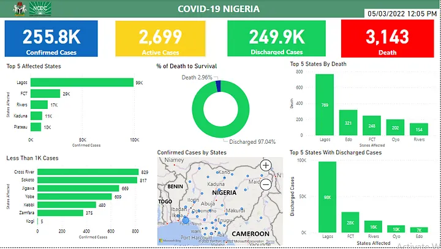

# COVID19_Data_Analysis
NCDC COVID-19 DATA ANALYSIS USING POWER BI

## Introduction
---
Recently, I worked on the National Center for Disease Control (NCDC) data and built a dashboard using power BI. The data used for this visualization was imported from ncdc.gov.ng on May 3rd 2022.

### Problem Statement
---
The purpose of this analysis was to answer the following questions:
1. Which state has recorded the highest Covid-19 cases?
2. What is the chance of survival for those infected?
3. How many cases have less than 1000 confirmed cases?
4. What is the total number of confirmed cases in all the states?
5. What is the total number of death recorded in all the states?

### Visualization 
---
I made the heading using shapes and text box. The Coat of arms and the NCDC logo were download from Google.

Then I used the card visual to show:

- the number of confirmed cases,
- active cases,
- discharged cases and
- deaths.
   

After that I created six more visuals

### 1.  TOP 5 AFFECTED STATES
   
   This visual shows the states with the most cases with Lagos having the highest with 99k+ cases.
   

---

### 2. DEATH TO SURVIVAL

This visual shows that majority of those who contacted COVID-19 survived. 97.04% of the confirmed cases survived and were discharged while 2.96% died.

---

###  3.  TOP 5 STATES BY DEATH
  
 This shows the 5 states with the highest number of deaths. Lagos has the highest number of deaths with 769 followed by Edo with 321.

 

---

 ### 4. LESS THAN 1000 CASES

  This shows the seven states that have not recorded up to 1000 COVID-19 cases with Kogi having the least cases (5).
  

---

### 5.  CONFIRMED CASES BY STATES

I used the map visual to show the cases of each state which can easily be seen by hovering over the blue circle on each state.

---

### 6.  TOP 5 STATES WITH DISCHARGED CASES

   With this we can see that Lagos has the highest number of discharged cases.

### Dashboard

Using the visuals above, i was ablw to provide solutions to the questions asked,

 1. The state with the highest recorded cases is Lagos State with 98k cases.
 2. There is a 97% chance of survival to anyone infected.
 3. 7 states have less than 1000 cases (Cross River, Sokoto, Jigawa, Yobe, Kebbi, Zamfara, and Kogi)
 4. The total number of confirmed cases is 256,000
 5. The total number of deaths recorded is 3,143.   

### Insights
1. There is a direct relationship between the population of the states and the cases recrorded i.e the higher the population of the state the more cases that are be recorded.
2. The high population in Lagos, FCT, Rivers, Kaduna, Plateau has seen them top the list of the most cases recorded.
3. Lagos, FCT, and Rivers have been able to effectively treat infected people with over 94% of the confirmed cases being discharged already. 
4. There is a 97% chance of survival to anyone who contracts the virus.
5. There is only a 3% chance that the virus leads to death 

### Recommendations
1. The State Government of the highly populated states should enforce strict regulations on the sit-at-home directive.
2. Healthcare facilities should be provided with enough vaccines, face masks, sanitizers and any other safety equipment needed. 
3. Attention should be paid to the health facilities in Edo State as they have a higher death to confirmed case ratio commpared to other states in the same range.
4. Awareness of the dangers of the virus should be broadcasted alongside the health and safety measures to follow.

Here's a link to the published version of the report - [Click here](https://app.powerbi.com/MobileLandingPage?ctid=48f2f0d2-cfbf-4c32-afbf-0e802467492f&pbi_source=linkShare&action=OpenLink&linkId=43TIO2mnO6)

Thank you.

